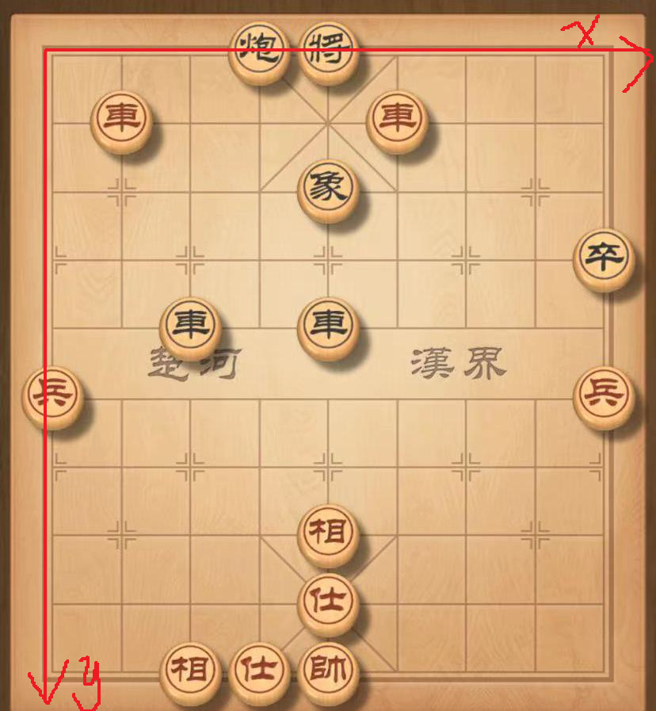
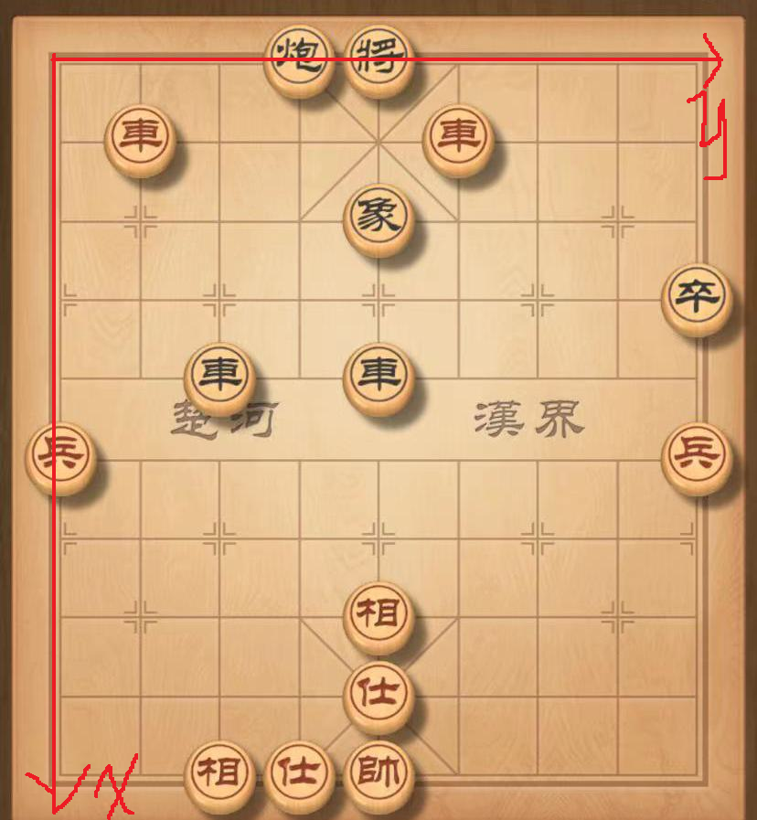

# 1. Astar
## 1.1. 实验目标
给定地图，使用 A* 搜索，解决最短路径问题。地图上包括起点、终点、补给点、不可通行处等。

## 1.2. 实验过程
### 1.2.1. 状态空间定义
由于补给的存在，最短路径可能需要绕路去补给站、而后前往终点。将每个格子作为搜索空间的一个状态不可行，因为去补给站的路相当于负边，而Dijkstra算法是不能解决带负边的最短路问题的。
因此定义每个状态为当前格子坐标+父节点方向，即从四个不同方向前往同一个格子时，会到达四个不同的状态。这样总的状态数为 $4 \times N \times M$ ，其中 $N \times M$ 为地图大小。状态空间增长了常数级，省去了很多算法的麻烦，可以接受。
最终只要到达终点对应的状态之一即可结束。

### 1.2.2. A* 搜索
#### 1.2.2.1. 算法思路
A* 搜索求最短路与Dijkstra算法相似，只是加入启发式函数加快搜索。算法伪代码如下：
```
while(open_list is not empyt){
	n = open_list.pop()
	close_list.push(n)

	if (n is target){
		output(path)
	}

	for all n's adjacent{
		if from_n_to_adj is a better path{
			update adj
			if (adj not in open_list){
				open_list.push(adj)
			}
		}
	}
}
```

其中close_list代表已经确定最短路径的结点，open_list代表已经探测到的、还未确定的结点。

#### 1.2.2.2. 实现细节
1. 加入close_list和open_list的是search_cell类型，保存了当前坐标和父结点search_cell。其他信息，如食物、累计代价等都在地图上保存。
2. 如前所述，我们的状态由当前结点坐标和父结点方向确定，因此地图上的每个结点有四个对应的状态。open_list和close_list中应该保存这四个状态。具体实现上，地图上的每个结点附有一个 `in_open_list[4]` 数组，标记了从四个方向前往此结点的状态是否在open_list中。而close_list则是set类型，需要时通过查找来确定是否在close_list中。这样做主要是因为结点在处理父结点时加入open_list，在处理自己时加入close_list。为了避免编号混乱，最终实现成了这样不太美观的样子。
3. 访问邻居结点只需要给坐标加上±1，然后访问地图即可。
4. 从n到adj是一条更好的路径，意思是减少了adj的累计代价，或者累计代价不变时增加了食物。
5. 查找到终点后，可以根据search_cell的parent成员回溯出最短路径。

### 1.2.3. 启发式函数
启发式函数采用到终点的曼哈顿距离。
#### 1.2.3.1. 可采纳性证明
曼哈顿距离是不考虑补给、不可通行处等因素时的路径长度，实际代价要考虑这些因素，因此启发式函数值一定小于实际代价，是可采纳的。
#### 1.2.3.2. 一致性讨论
对于地图上的结点而言是一致的，因为我们的任务限制了只能走直线，每走一步代价为 1 ，曼哈顿距离最多减少 1 ，因此总是一致的。
对于我们的状态空间而言，同一个坐标对应的四个状态只在食物、累计代价等地方不同，坐标和启发式函数都一样，因此也是一致的。

### 1.2.4. 与一致代价搜索比较
在启发式函数总为 0 时，相当于是Dijkstra算法，处理十个输入的总步数为：
```
num_step for all input without Heuristic: 10000
```
在采用曼哈顿距离后，总步数为：
```
num_step for all input with manhattan distance as Heuristic: 3944
```
可见曼哈顿距离虽然是一种简单的启发式函数，但能有效降低搜索次数。

# 2. alpha-beta剪枝
## 2.1. 实验目标
使用"alpha-beta剪枝"算法，编写一个中国象棋对弈程序，给定残局输出下一步。

## 2.2. 实验过程
### 2.2.1. 输出说明
#### 2.2.1.1. 坐标系
本次实验框架的坐标系并不一致，据我观察，应该是这样：

1. 下图为move列表的坐标系，同时也是评分矩阵的坐标系，观察红方车的合法行动可知：


2. 下图为board类的坐标系，在代码的任意阶段打断点观察board类可知：


而群里面通知，最终输出要从左下角开始编号，和上面两个坐标系都不一样，实在不方便。我选择采用第一种坐标系，和move列表保持一致，方便调试。
比方说，上图中红方的两个车在输出中会编号为 (1, 1) 和 (5, 1)，黑方的将为 (4,0)，红方的帅为 (4, 9)。

#### 2.2.1.2. 输出结构
1. 实验要求的下一步输出到output/output_ .txt中. 
2. 双方初始的合法动作会输出到move/red_ .txt或者move/black_ .txt中。
3. 当前棋局用cout打印。

### 2.2.2. 评估函数
采用框架中给定的数据，根据当前棋盘进行棋子价值和棋力评估。
如果下一步能吃子，会减少棋子价值，因此不使用行棋可能性评估，也会倾向于能吃子的情况。
默认红方先走，红方为Max方。

### 2.2.3. alpha-beta剪枝
#### 2.2.3.1. 算法思路
对每个结点，Alpha表示目前所有可能解中的最大下界，Beta表示目前所有可能解中的最小上界，当alpha > beta时此结点不可能产生最优解，进行剪枝。

伪代码如下：
```
int alphaBeta(GameTreeNode& node, int alpha, int beta, int depth, bool isMaximizer){
	if depth == 0 or terminate:
		return current_node_evaluation

	for move in move_list:
		child_node = node.updateBoard(move)
		temp = alphaBeta(child_node, alpha, beta, depth - 1, !isMaximizer)
		if isMaximizer:
			alpha = max(alpha, temp)
			if alpha >= beta:
				break; //剪枝
		else :
			beta = min(beta, temp)
			if alpha >= beta:
				break; //剪枝

	return isMaximizer ? alpha : beta;
}
```

#### 2.2.3.2. 实现细节
1. 因为只要求输出一步，所以每个子节点算完估计值就删除了，没有链接到当前结点上。
2. 每个Move有score值，因此根据score对move列表进行排序，应该会加快搜索。但是实际上效果一般，可能move的score值只考虑单个棋子位置，参考价值小。
3. 给每个GameTreeNode结点加了best_step属性，代表下一步最佳行棋。最后输出root的best_step即可。

### 2.2.4. 实验结果
#### 2.2.4.1. 耗时
不同深度时，处理所有输入，搜索阶段的总耗时如下：

| 搜索深度 | 用时       |
| ---- | -------- |
| 5    | 293650ms |
| 4    | 20192ms  |
| 3    | 2109ms   |
可以看到随着深度增加，耗时显著增加。
同时也观察到能一步将军的输入明显耗时少，搜索深度加大没什么影响。主要都在处理需要多步行棋的输入。

#### 2.2.4.2. 剪枝的影响
不采用剪枝时，深度为3，测试搜索阶段总耗时：
```
total time for all file: 34052ms
```
比之前增长了15倍左右，剪枝时深度为4都比这次快，可见剪枝效果显著。

#### 2.2.4.3. 下一步的好坏
没有想到什么好的评估办法。
对于走一步就能将军的棋局，比如input_1、2、3等都会去将军，无论深度如何。
对于走势不明朗的棋局，比如input_9，都是移动将旁边的炮，不同深度的落点不一，但也看不出哪种更好。
用找到的象棋AI [皮卡鱼](https://ai.pikafish.org/#/) 摆了一下input_9，也选择移动这个炮，但是落点和我测试的三个都不一样。也尝试了其他残局，同样选择将军时，行棋也不同。
总之行棋有一定合理性（都会将军，或者都移动了同一个棋子），但难以比较不同深度的结果。


